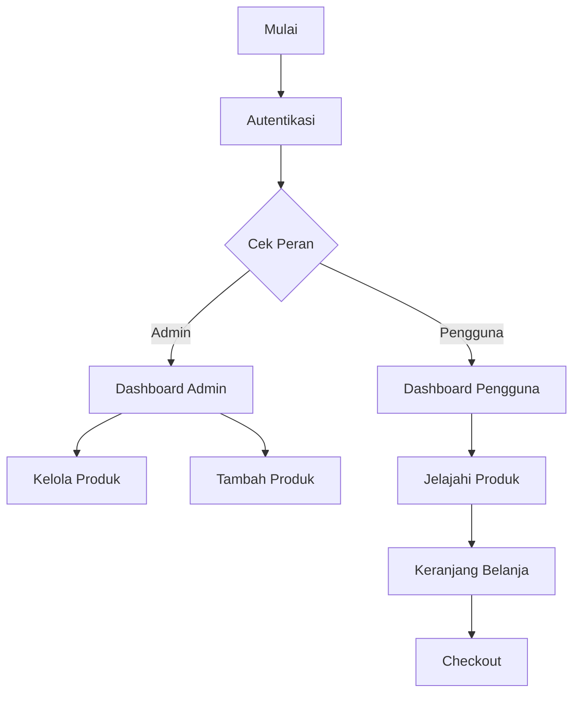

# 📱 Aplikasi E-Commerce Flutter

Aplikasi e-commerce yang dibangun menggunakan Flutter dengan integrasi Firebase.

## 📑 Daftar Isi
- [Struktur Proyek](#-struktur-proyek)
- [Alur Aplikasi](#-alur-aplikasi)
- [Model Data](#-model-data)
- [Layanan](#-layanan)
- [Layar Aplikasi](#-layar-aplikasi)
- [Autentikasi](#-autentikasi)
- [Integrasi Firebase](#-integrasi-firebase)
- [Manajemen State](#-manajemen-state)
- [Keamanan](#-keamanan)
- [Praktik Terbaik](#-praktik-terbaik)
- [Instalasi & Pengaturan](#-instalasi--pengaturan)
- [Dependensi](#-dependensi)
- [Pengembangan Mendatang](#-pengembangan-mendatang)
- [Kontribusi](#-kontribusi)
- [Lisensi](#-lisensi)

## 📁 Struktur Proyek

```
lib/
├── main.dart
├── models/
│   ├── cart_item.dart
│   └── product.dart
├── screens/
│   ├── auth/
│   │   ├── login_screen.dart
│   │   └── register_screen.dart
│   ├── home_screen.dart
│   ├── product_list_screen.dart
│   ├── cart_screen.dart
│   ├── profile_screen.dart
│   └── add_product_screen.dart
└── services/
    ├── auth_service.dart
    ├── cart_service.dart
    └── product_service.dart
```

## 🔄 Alur Aplikasi



## 📊 Model Data

### Model Produk
```dart
class Product {
  final String id;
  final String name;
  final String description;
  final double price;
  final String imageUrl;
  final int stock;
}
```

Fitur utama:
- ✨ Penyimpanan informasi produk
- 🔥 Integrasi Firestore
- 📦 Manajemen stok
- 🖼️ Penanganan URL gambar

### Model Item Keranjang
```dart
class CartItem {
  final String id;
  final String userId;
  final String productId;
  final int quantity;
  final DateTime createdAt;
  final DocumentReference productRef;
}
```

## 🛠️ Layanan

### AuthService
Menangani autentikasi pengguna dan manajemen peran:
```dart
class AuthService extends ChangeNotifier {
  final FirebaseAuth _auth = FirebaseAuth.instance;
  User? get user => _auth.currentUser;
}
```

### CartService & ProductService
Mengelola operasi keranjang belanja dan manajemen produk.

## 📱 Layar Aplikasi

### Layar Autentikasi
- 🔐 Login
- 📝 Registrasi

### Layar Utama
- 🏠 Beranda
- 📋 Daftar Produk
- 🛒 Keranjang
- 👤 Profil
- ➕ Tambah Produk (Admin)

## 🔒 Keamanan

### Keamanan Autentikasi
- ✉️ Verifikasi email
- 🔑 Persyaratan kekuatan password
- 🎟️ Manajemen sesi
- 🔐 Penyimpanan token yang aman

### Keamanan Data
- 👥 Kontrol akses berbasis peran
- ✅ Validasi input
- 🛡️ Aturan Firebase yang aman
- 🔒 Enkripsi data

## 💻 Instalasi & Pengaturan

1. Clone repositori
```bash
git clone [url-repositori]
```

2. Konfigurasi Firebase
```bash
flutter pub add firebase_core
flutter pub add firebase_auth
flutter pub add cloud_firestore
```

3. Jalankan aplikasi
```bash
flutter run
```

## 📦 Dependensi

```yaml
dependencies:
  flutter:
    sdk: flutter
  firebase_core: ^latest
  firebase_auth: ^latest
  cloud_firestore: ^latest
  provider: ^latest
  cached_network_image: ^latest
```

## 🚀 Pengembangan Mendatang

### Fitur
- 💳 Integrasi pembayaran
- 📦 Manajemen pesanan
- 🔔 Notifikasi push
- 🏷️ Kategori produk

### Teknis
- 📵 Dukungan offline
- ⚡ Optimasi performa
- 📊 Integrasi analitik
- 🔐 Peningkatan keamanan

## 🤝 Kontribusi

1. Fork repositori
2. Buat branch fitur (`git checkout -b fitur-baru`)
3. Commit perubahan (`git commit -m 'Menambah fitur baru'`)
4. Push ke branch (`git push origin fitur-baru`)
5. Buat Pull Request

## 📄 Lisensi

Proyek ini dilisensikan di bawah Lisensi MIT - lihat file LICENSE untuk detail.
